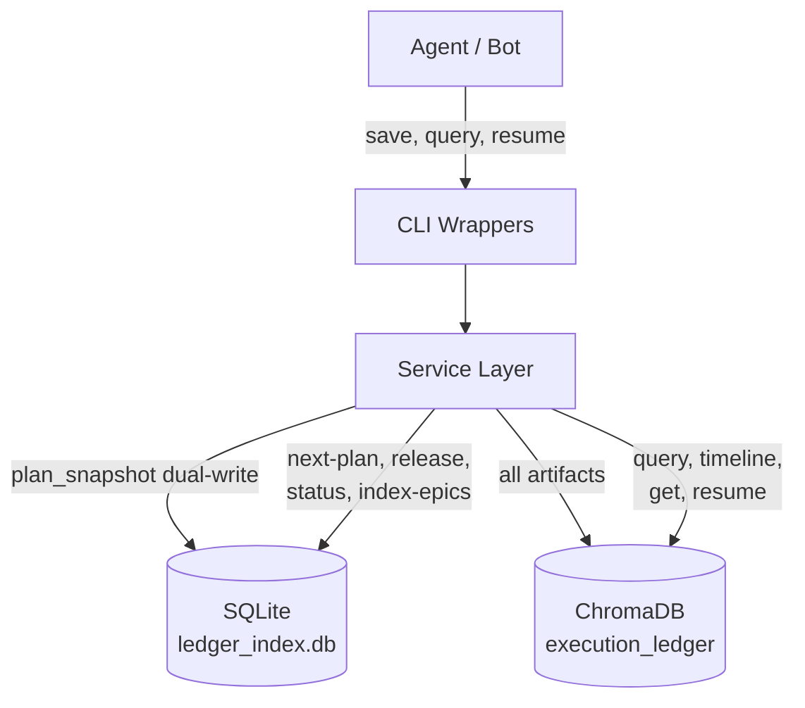

# Local Development & Testing

This document outlines the requirements and processes for developing, testing, and evaluating AI agent skills within this repository.

**Important**: Developers should never — or very rarely — need to write code directly. All changes should be driven through natural-language prompt requests to the agent, using `/feature-epic` for multi-component features and `/bug-fix` or `/tdd-execute` for targeted work. The agent handles domain decomposition, implementation, testing, and PR creation. Your role is to provide requirements, review plans, approve gates, and audit the results.

To strictly adhere to our core safety and [Environment Isolation](./delegation_protocol.md) protocols, **all code compilation, execution, and testing must be performed within isolated Docker containers** rather than on your bare-metal workstation. See [Container Security Model](./container_security.md) for the 3-layer enforcement architecture, file-level deny rules, and instructions for making legitimate changes to protected files.

## Skill Routing

When starting work, choose the right entry point based on task scope:

| Task Type | Skill | Example Prompt |
|-----------|-------|----------------|
| Large multi-domain feature | `/feature-epic` | "Here's JIRA ticket ACME-XYZ. Decompose into domains and waves." |
| Multi-domain implementation | `/agent-team` | "Implement this plan using agent-team with wave gating." |
| Single feature or bug (TDD) | `/tdd-execute` | "Add retry logic to the S3 uploader using TDD." |
| Bug diagnosis and fix | `/bug-fix` | "Users are seeing timeout errors in the DMS migration." |
| Simple docs/config edits | Just describe the task | "Update the glossary entry for ChromaDB." |

For simple work, you don't need to invoke a skill — just describe what
you want and the agent's planning protocol will route correctly. Use
explicit skills when the task matches the signals above. See
[planning_protocol.md](planning_protocol.md) §4 (Skill Routing Guide)
for the full decision framework.

## Prerequisites

Ensure you have the following installed on your local workstation:

1. [Docker](https://docs.docker.com/get-docker/) & Docker Compose
2. [Task (go-task)](https://taskfile.dev/)
3. [GitHub CLI (`gh`)](https://cli.github.com/)
4. [`aws-vault`](https://github.com/99designs/aws-vault#installing) *(Optional)*: Required if you need the agent to perform actions that access AWS resources, for secure AWS token management.

## Environment Setup (Agent Credentials)

The eval test suite auto-detects which agent runner to use based on
available credentials. Detection follows this priority order:

### 1. Claude Code (Primary)

Claude Code is the primary agent platform. The runner first checks
for the `claude` CLI binary on PATH — if found, it uses enterprise
OAuth (no API key needed). This is the default for local development
when you've authenticated via `claude auth login`.

If the CLI is not on PATH, the runner falls back to checking the
`ANTHROPIC_API_KEY` environment variable (for CI/CD environments
where OAuth is unavailable).

**Local dev**: Just ensure `claude` is installed and you've run
`claude auth login`. No env var needed.

**CI/CD**: Set `ANTHROPIC_API_KEY` (obtain from
[console.anthropic.com](https://console.anthropic.com)).

### 2. GitHub Copilot (Alternative)

If Claude Code is not available, the runner checks for
`COPILOT_GITHUB_TOKEN`. Set it to your `gh` CLI token:
`export COPILOT_GITHUB_TOKEN="$(gh auth token)"`

### 3. Gemini CLI (Active)

The `GeminiRunner` invokes `@google/gemini-cli`, which is installed in both
the `agent-cli` and `pytest-cli` Docker containers. Set `GEMINI_API_KEY` to
your Gemini API key to enable Gemini-based eval runs and bridge agent reviews.

To set up the `agent-cli` container before running Gemini bridge reviews:

```bash
docker compose build agent-cli
task agent:preflight:copilot
```

`task agent:preflight:copilot` verifies that `codex`, `gh copilot`, and `gemini` CLIs
are reachable inside the container and that the required auth tokens are
available.

### 4. Codex CLI (Eval Runner & Bridge Reviews)

The `CodexRunner` invokes `@openai/codex` for Codex-based eval runs. Set
`OPENAI_API_KEY` to your OpenAI API key to enable Codex-based evals. The
`codex-reviewer` bridge agent also uses a tiered pre-flight
(`task agent:preflight:codex`) that checks availability in order:

1. **Local OAuth** — `codex` CLI on PATH + `~/.codex/auth.json` present.
   Reviews run natively on the host via `task agent:review:codex:local`.
2. **Local API key** — `codex` CLI on PATH + `OPENAI_API_KEY` set.
   Reviews run natively on the host via `task agent:review:codex:local`.
3. **Container** — falls back to the `agent-cli` Docker container via
   `task agent:review:codex`.

If all tiers fail, the reviewer is excluded from the gate gracefully.

**One-time host setup** — provision the reviewer profile on your local machine:

```bash
task agent:setup:codex-reviewer
```

This writes the `[profiles.reviewer]` section to `~/.codex/config.toml` from
the canonical source at `docker/agent-cli/codex-config.toml`. Required for
local-mode (tiers 1 and 2) invocations. The container image already includes
this profile.

**Container setup** (only needed if local tiers are unavailable):

```bash
docker compose build agent-cli
task agent:preflight:copilot
```

### Summary

| Priority | Agent | Detection | Env Var (fallback) |
|----------|-------|-----------|-------------------|
| 1 | Claude Code | `claude` CLI on PATH (OAuth) | `ANTHROPIC_API_KEY` |
| 2 | GitHub Copilot | — | `COPILOT_GITHUB_TOKEN` |
| 3 | Gemini CLI | `@google/gemini-cli` in `agent-cli` container | `GEMINI_API_KEY` |
| 4 | Codex CLI | `@openai/codex` in `agent-cli` container | `OPENAI_API_KEY` |

ClaudeCodeRunner is the primary eval runner; Copilot, Gemini, and Codex are
secondary runners for cross-family coverage. You can override auto-detection
with `EVAL_RUNNER=claude`, `EVAL_RUNNER=copilot`, `EVAL_RUNNER=gemini`, or
`EVAL_RUNNER=codex`.

`GH_TOKEN` is used by the `gh` CLI itself for repository and artifact
operations and is independent of the agent runner selection.

1. Authenticate your local GitHub CLI if you haven't already:

   ```bash
   gh auth login
   ```

2. Expose your credentials to the local environment. You have a few options:

   **Option A: Using `direnv` (Recommended)**
   If you use [direnv](https://direnv.net/), simply add this to your `.envrc` file so it evaluates dynamically every time you enter the directory:

   ```bash
   echo '# See docs/local_development.md for details' > .envrc
   echo '# GH_TOKEN is used by the `gh` CLI in isolated Docker containers for native authentication.' >> .envrc
   echo 'export GH_TOKEN="$(gh auth token)"' >> .envrc
   echo '' >> .envrc
   echo '# Set the credential for your chosen eval runner (claude, copilot, or gemini).' >> .envrc
   echo 'export ANTHROPIC_API_KEY="<your-anthropic-api-key>"' >> .envrc
   echo 'export COPILOT_GITHUB_TOKEN="$GH_TOKEN"' >> .envrc
   direnv allow
   ```

   API keys (secrets) should go in `.env` (gitignored), not `.envrc`. Add `GEMINI_API_KEY`, `OPENAI_API_KEY`, and other secrets there:

   ```bash
   echo "GEMINI_API_KEY=<your-gemini-api-key>" >> .env
   echo "OPENAI_API_KEY=<your-openai-api-key>" >> .env
   ```

   **Option B: Manual Export**
   Before running the tests, export the credential for your chosen agent directly in your shell:

   ```bash
   export GH_TOKEN="$(gh auth token)"
   # For Claude Code evals:
   export ANTHROPIC_API_KEY="<your-anthropic-api-key>"
   # For Copilot evals:
   export COPILOT_GITHUB_TOKEN="$GH_TOKEN"
   # For Gemini evals:
   export GEMINI_API_KEY="<your-gemini-api-key>"
   # For Codex evals:
   export OPENAI_API_KEY="<your-openai-api-key>"
   ```

   **Option C: Using a static `.env` file**
   If you prefer a static file, evaluate the tokens and save them to `.env`:

   ```bash
   echo "GH_TOKEN=$(gh auth token)" > .env
   echo "ANTHROPIC_API_KEY=<your-anthropic-api-key>" >> .env
   echo "COPILOT_GITHUB_TOKEN=$(gh auth token)" >> .env
   echo "GEMINI_API_KEY=<your-gemini-api-key>" >> .env
   echo "OPENAI_API_KEY=<your-openai-api-key>" >> .env
   ```

   *(Note: If you use this fallback method, make sure `dotenv: ['.env']` is manually added to your [Taskfile.yml](../Taskfile.yml) so it loads).*

   **`.env` vs `.envrc` separation**: Keep secrets (API keys, tokens) in `.env` (gitignored). Keep non-secret
   configuration (e.g., `EVAL_RUNNER`, `DOCKER_BUILDKIT=1`) in `.envrc` (committed or locally allowed via
   `direnv allow`). This separation prevents accidental secret commits while keeping shareable config in version
   control.

## Persistent Data Directory (`~/.brownfield-ai/`)

**Both ChromaDB and the Execution Ledger are global.** They live in
`~/.brownfield-ai/` on the host machine — outside any repository clone. You
can work from any `brownfield-ai-*` workspace on your laptop (e.g.,
`brownfield-ai-1/`, `brownfield-ai-2/`, `brownfield-ai-3/`) and all of them share the
same plan registry, artifact history, and vector database. Plans
created in one workspace are visible and resumable from any other.
A bot running in `brownfield-ai-3` can claim a plan that was authored in
`brownfield-ai-1`.

Data survives container restarts, branch switches, and `task clean`
runs.

> **TIP**: Back up `~/.brownfield-ai/` regularly. This data is local to your
> machine only — it is not synced to any remote service or shared
> storage. It contains your entire planning history, design decisions,
> gate verdicts, and conversation checkpoints. If your laptop is lost
> or the disk fails, this data is gone. A simple periodic backup:
> `cp -r ~/.brownfield-ai/ ~/.brownfield-ai-backup-$(date +%Y%m%d)/`

```text
~/.brownfield-ai/
├── chroma_data/          # ChromaDB vector database (embeddings, documents)
│   └── chroma.sqlite3    # ChromaDB internal metadata store (do NOT modify)
└── ledger_index.db       # Execution Ledger SQLite plan registry (epic
                          # lifecycle, claims, deps, priority)
```

### ChromaDB (`~/.brownfield-ai/chroma_data/`)

Stores all ChromaDB collections: `execution_ledger` (plan artifacts),
`chat_history` (conversation checkpoints), and `long_term_document`
(free-form knowledge). Mounted into the `global-chromadb` container
via [docker-compose.chromadb.yml](../docker-compose.chromadb.yml) as
`~/.brownfield-ai/chroma_data:/data`.

**Start ChromaDB:**

```bash
task chromadb:start
```

The agent will auto-start ChromaDB if it's not running — you typically
don't need to start it manually. These tasks are provided for manual
control when needed:

- `task chromadb:start` — start the global instance
- `task chromadb:stop` — stop the global instance
- `task chromadb:status` — check if it's running

**CRITICAL**: Do NOT delete or modify `~/.brownfield-ai/chroma_data/`
directly. Do NOT mount it to `/chroma/chroma` (it will be ignored).
Do NOT add a `chromadb` service to the repo's `docker-compose.yml` —
the global instance prevents port collisions across workspaces. See
[docs/learnings.md](learnings.md) for full gotchas.

### Execution Ledger SQLite (`~/.brownfield-ai/ledger_index.db`)

The lightweight plan registry for ACID-safe epic lifecycle management
(status transitions, claims, dependency resolution, priority
scheduling). Accessed by the `python-cli` container via the volume
mount `~/.brownfield-ai:/brownfield-ai` in [docker-compose.yml](../docker-compose.yml),
which maps to `/brownfield-ai/ledger_index.db` inside the container.

The SQLite DB is auto-created on first use by the `execution-ledger`
script. No manual setup required.

### Backup

Both files can be backed up by copying `~/.brownfield-ai/`:

```bash
cp -r ~/.brownfield-ai/ ~/.brownfield-ai-backup-$(date +%Y%m%d)/
```

ChromaDB data can also be exported as text via the `knowledge-export`
skill for import into external tools (see the Developer Workflow
section below).

## Architecture

Our testing framework uses a three-stage orchestrated pipeline built on `pytest`:

1. **Infrastructure Mocking**: Tests dynamically spin up a [LocalStack](https://localstack.cloud/) emulator ([tests/envs/aws/docker-compose.yml](../tests/envs/aws/docker-compose.yml)) to mock our AWS production environment.
2. **Isolated Execution**: For `test:brownfield_ai` and `test:scripts`, we use a dedicated `pytest-cli` Docker image. This strictly isolates the test suite's dependencies (`pytest`, `pexpect`) from the production script runner (`python-cli`). For `test:skills`, a local `.venv/` is used instead because headless `claude -p` requires OAuth via the host session (see [CLAUDE.md](../CLAUDE.md) Principle 11).
3. **Headless Agent Invocation**: We use `pexpect` inside the test runner to programmatically invoke the configured agent CLI (e.g., `claude`, `gh copilot suggest`), piping prompts into the LLM safely without requiring manual keyboard input. The active runner is selected via `get_runner()` based on available credentials, or overridden via `EVAL_RUNNER`.

## Running Tests

### One-Time Setup

Before running evaluations locally for the first time, initialize the virtual environment:

```bash
task test:setup
```

This creates a `.venv/` in the repository root and installs all test dependencies. You only need to run this once (or after dependency changes).

### Test All Skills

To run the centralized evaluation test suite against all AI skills:

```bash
task test:skills
```

This uses the local `.venv/` — Docker is **not** required. The active agent runner is resolved automatically from your environment credentials (priority: claude > copilot > gemini), or you can pin a specific runner:

```bash
EVAL_RUNNER=claude task test:skills
EVAL_RUNNER=copilot task test:skills
```

See [tests/README.md](../tests/README.md) for the full test directory
structure, eval authoring guide, and runner configuration details.

**What happens under the hood?**

1. Activates the local `.venv/` and discovers all iteration parameters from `tests/skills/*/evals/evals.yml`.
2. Selects the active agent runner via `get_runner()` based on available credentials or `EVAL_RUNNER`.
3. Connects the runner to isolated temporary sandbox directories, grades the outputs, and emits a `junit.xml` validation report.

**Important notes about skill evals:**

- **Probabilistic by nature.** Skill evals invoke a real LLM via the
  agent CLI (`claude -p`, `copilot`, etc.). LLM responses are
  non-deterministic — the same prompt can produce slightly different
  output each run. We minimize flakiness by using substring assertions
  (`assert "keyword" in output`) rather than exact-match comparisons,
  and by constraining the LLM's response scope in the `agent_prompt`.
  Occasional failures are expected; re-run before investigating.
- **Slow and token-consuming.** Each eval makes one or more API
  requests to external LLM servers. The LLM's reasoning (thinking)
  phase can take 10–60 seconds per eval depending on the model and
  prompt complexity. A full skill eval suite may take several minutes.
  Each run consumes API tokens — be mindful of cost when running
  repeatedly.
- **Unit tests are the primary gate.** The `task test:scripts` tests
  are fast, deterministic, and free (no API calls). Skill evals are a
  secondary validation layer for agent-level integration. CI gates
  should rely on unit tests; skill evals are for local validation and
  regression spotting.

### Test brownfield-ai (AWS / LocalStack)

The `test:brownfield_ai` target requires Docker and spins up LocalStack to mock AWS infrastructure:

```bash
task test:brownfield_ai
```

**What happens under the hood?**

1. Spins up the AWS LocalStack emulator (`up -d`).
2. Builds the isolated `pytest-cli` Docker container.
3. Runs the brownfield-ai test suite inside the container against the mocked AWS environment.
4. Tears down LocalStack gracefully.

### Execution Ledger (ChromaDB + SQLite)

The execution ledger persists planning artifacts, design decisions,
gate verdicts, and test results across sessions. It enables any agent
to resume an in-progress epic and provides a complete audit trail for
human and agent reviewers.



#### Developer Workflow

**1. Planning phase** — A developer receives a JIRA ticket (e.g.,
`ACME-2931`) containing the product/business requirements. The developer
works with the agent to decompose the requirements into a technical
plan following the `/feature-epic` skill:

> "Here's the JIRA ticket ACME-2931. Help me break this down into
> domains, waves, and an execution strategy."

The agent produces `plan.md` with domains, wave assignments, cost
analysis, and requirement IDs. The plan goes through Dual-Model Review.
Once both reviewers return GREEN, the developer asks the agent to
persist the approved plan:

> "Checkpoint this plan to the ledger as approved."

The plan snapshot now lives in the execution ledger with
`epic_status: approved`, searchable and resumable by any future agent
or session.

**2a. Developer-driven implementation** — The developer approves the
plan and gives the Planner agent the green light to begin execution:

> "Plan approved. Proceed with implementation."

The agent transitions to the Orchestrator role, delegates to
`agent-team`, and drives the wave-by-wave R-G-R execution loop.
At each gate (post-wave, regression), the agent checkpoints verdicts,
step results, and wave summaries to the ledger. If the session is
interrupted or a new session picks up the work, the developer resumes:

> "Resume epic ACME-2931."

The agent queries the ledger for the latest plan, completed steps,
and gate history — picking up exactly where work left off.

**Note on `/protocols`**: In interactive sessions, CLAUDE.md is
automatically loaded at startup — you do not need to invoke
`/protocols` at the beginning. Use it mid-session if the agent starts
drifting (ignoring delegation rules, skipping verification gates, or
writing code directly as the Orchestrator).

**2b. Bot/runner-driven implementation** — Instead of a developer
manually approving each plan, a runner (cron job, polling script, or
CI bot) queries the ledger for the next eligible plan:

```bash
claude -p "Refocus on /protocols. Then query the execution ledger \
  for the next available plan. Claim it and begin implementation \
  following the agent-team protocol. Checkpoint all artifacts to \
  the ledger as you go." \
  --allowedTools "Bash(docker compose *),Bash(git *),Bash(task *),Read,Edit,Write"
```

The `/protocols` invocation is critical — without it, the headless
session has no awareness of CLAUDE.md directives, delegation rules,
or verification gates.

**Sandbox and permissions**: The `--allowedTools` flag grants specific
tool permissions while keeping the sandbox active — file read/write
restrictions and network controls remain enforced. This is the
recommended approach for enterprise environments.

Avoid `--dangerously-skip-permissions` unless running in a fully
isolated environment (container, VM). While it does not disable the
sandbox itself, it bypasses all permission prompts globally, which
may conflict with org-managed security policies. Organizations can
block it entirely via `disableBypassPermissionsMode` in managed
settings. If your org restricts this flag, use `--allowedTools` with
the specific patterns your bot needs instead.

The runner calls `next-plan` under the hood, which atomically claims
the highest-priority plan whose dependencies are satisfied. The bot
executes the full plan headlessly, checkpointing progress at every
gate. If the bot crashes or stalls for 24 hours, the plan is
auto-released back to the available pool for another runner to claim.

Multiple bots can run concurrently — the ACID-safe claiming in SQLite
guarantees no two bots claim the same plan.

**3. Audit and review** — At any point, a developer or agent can
inspect the full decision trail:

> "Show me the timeline for epic ACME-2931."

> "What design decisions were made and why?"

> "Show me all gate verdicts — which reviewers approved and what did
> they flag?"

The ledger provides the complete audit trail: every plan version,
every design rationale, every gate verdict with reviewer reasoning,
and every test result (sanitized of secrets and PII).

**4. Versioning** — The ledger keeps a full version history of every
artifact. Nothing is ever deleted. When a plan is revised, the old
version is marked `superseded` and the new one becomes `active`.
Agents querying the ledger only see the current state, but auditors
can view the full evolution of any artifact. Ask the agent:

> "Show me all versions of the plan for ACME-2931."

See the
[Versioning and Supersession](../workflows/agent-memory/skills/execution-ledger/SKILL.md#versioning-and-supersession)
section in the SKILL.md for technical details on how versioning works
with ChromaDB.

See [execution-ledger SKILL.md](../workflows/agent-memory/skills/execution-ledger/SKILL.md)
for the full sub-command reference, metadata schema, lifecycle state
machine, and architecture details.

**5. Exporting for external analysis** — You can export all plan
details, design decisions, gate verdicts, and artifacts as a single
text file for analysis in external tools. Ask the agent:

> "Export all ChromaDB data to a text file."

The agent uses the `knowledge-export` skill to generate a consolidated
file containing every document across all collections (including the
`execution_ledger`). This is useful for:

- Uploading to [NotebookLM](https://notebooklm.google.com/) to create
  a queryable notebook over your project's full planning and execution
  history
- Sharing with stakeholders who need to review the decision trail
  without CLI access
- Backing up ledger state before major changes
- Feeding into other analysis tools (the export format is structured
  markdown with YAML metadata blocks, parseable by most tools)

The exported file lands at `tmp/chroma_export.txt` by default. See
[knowledge-export SKILL.md](../workflows/agent-memory/skills/knowledge-export/SKILL.md)
for details.

**6. Chat history checkpointing** — At the end of a productive session
(or any time you want to preserve the conversation), ask the agent:

> "Checkpoint this chat."

The agent uses the `knowledge-checkpoint` skill to save the full
conversation history (user messages, agent responses, tool calls) into
the `chat_history` ChromaDB collection. This serves two purposes:

**For you (the developer):** Your conversations contain valuable
context — architectural discussions, debugging sessions, decisions
made verbally that never made it into code comments, and lessons
learned from failures. Checkpointing preserves this so you can recall
it later:

> "Search my chat history for the discussion about the Redshift
> migration approach."

> "What did we decide about the authentication flow last week?"

**For agents:** When a new session starts, agents can query
`chat_history` during their Memory Check (Step 0/1 of `feature-epic`
and `agent-team`) alongside [docs/learnings.md](learnings.md) (documented gotchas)
and the Execution Ledger (plan artifacts). Together, these three
sources give the agent a complete picture: `learnings.md` captures
formalized technical gotchas, the ledger captures structured planning
decisions, and `chat_history` captures the informal conversations
in between — like why a particular approach was rejected, what
trade-offs were debated, or what gotchas were encountered during a
previous attempt that haven't been formalized into `learnings.md` yet.

Each checkpoint stores the full conversation as a single document with
metadata (timestamp, source platform, line count), enabling both
semantic search ("find discussions about X") and chronological
browsing. See
[knowledge-checkpoint SKILL.md](../workflows/agent-memory/skills/knowledge-checkpoint/SKILL.md)
for details.

### Real-time Logs / Debugging

If a test is hanging or you want to see exactly what the agent is generating in real-time, `task test:skills` passes the `-s` verbose flag to Pytest, ensuring the agent's output streams back to your terminal automatically.
