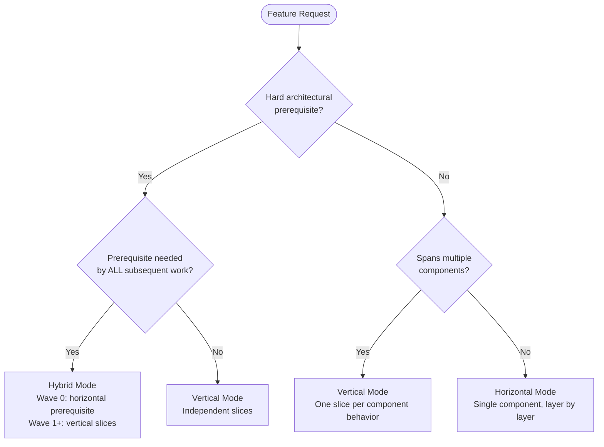
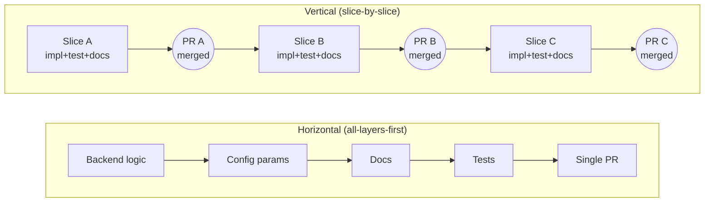
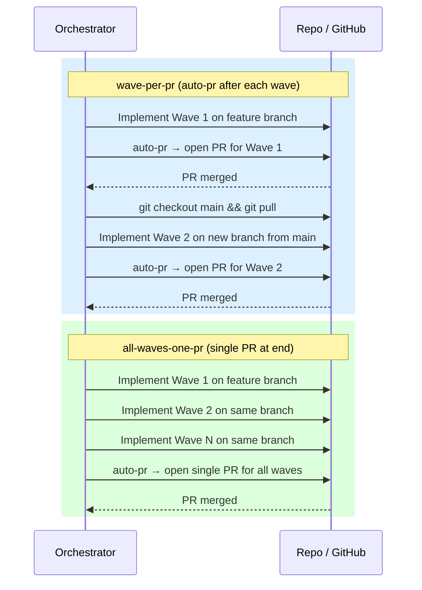
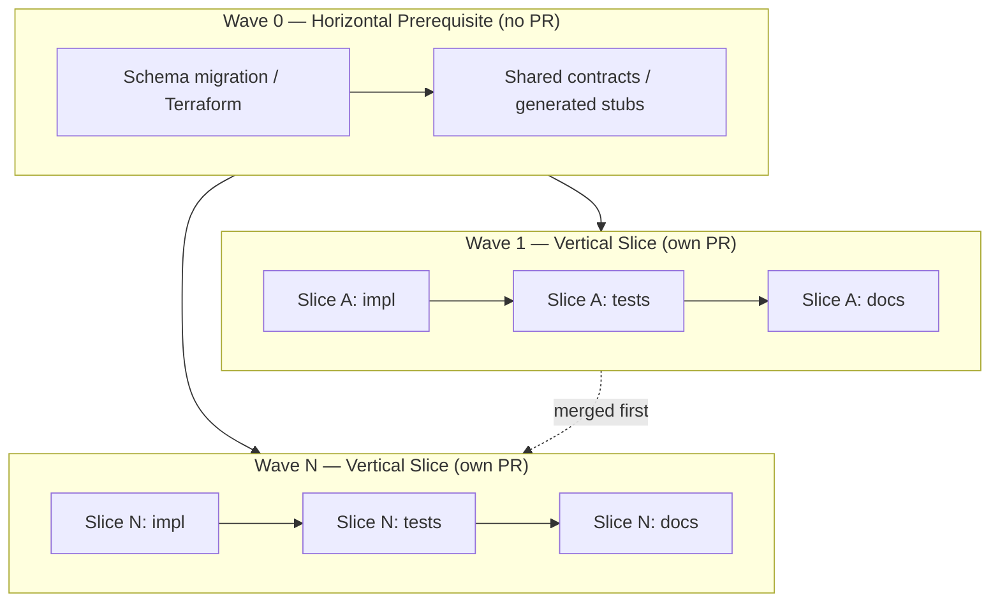

# Vertical Slicing Guide

Vertical slicing is the default decomposition strategy for all plans.
Each "slice" delivers a complete, independently mergeable unit of user-facing capability — spanning implementation, tests, and documentation — rather than grouping work by technical layer.

For the authoritative decision process, see [planning_protocol.md §3](planning_protocol.md).

---

## 1. Decision Flowchart

Use this to determine the right decomposition mode before drafting a plan.

[Decision Flowchart (SVG)](diagrams/vertical-slicing/decision-flowchart.svg)

| Mode | When to use |
|------|-------------|
| **Vertical** | Feature spans multiple components, or slices can be made independently mergeable |
| **Horizontal** | Single component; each layer is a natural checkpoint (e.g., pure infra work) |
| **Hybrid** | Hard shared prerequisite (schema, Terraform, contract) that ALL slices depend on |

---

## 2. Horizontal vs Vertical Timeline Comparison

The same feature takes the same total effort either way — but vertical slicing delivers feedback after every slice rather than only at the end.

[Timeline Comparison (SVG)](diagrams/vertical-slicing/timeline-comparison.svg)

- **Horizontal**: Feedback only arrives at the final PR. Rework can invalidate all prior layers.
- **Vertical**: Feedback after each slice. Rework is scoped to the affected slice only.

---

## 3. Merge Strategy PR Workflow

The Orchestrator supports two merge strategies. Choose at plan time based on whether slices are truly independent.

[Merge Strategy Workflow (SVG)](diagrams/vertical-slicing/merge-strategy-workflow.svg)

| Strategy | Use when |
|----------|----------|
| `wave-per-pr` | Slices are independently deployable; team prefers incremental review |
| `all-waves-one-pr` | Slices have shared context or reviewers prefer a single review pass |

---

## 4. Hybrid Decomposition

Use Hybrid Mode when a genuine hard prerequisite exists (e.g., a schema migration that every slice depends on). Wave 0 is the horizontal prerequisite layer — it ships no PR of its own and no test domain. Waves 1–N are vertical slices, each with its own PR.

[Hybrid Decomposition (SVG)](diagrams/vertical-slicing/hybrid-decomposition.svg)

**Wave 0 rules:**

- Contains only shared infrastructure (migrations, Terraform, generated stubs, shared contracts).
- Does NOT get its own PR — Wave 0 is a non-PR wave. Its changes are committed to the branch and included in Wave 1's PR when using `wave-per-pr`, or in the single PR when using `all-waves-one-pr`.
- Does NOT have a test domain (tests live in the slice that exercises the infrastructure).

**Wave 1–N rules:**

- Each wave is a vertical slice: implementation + tests + documentation.
- Each wave gets its own PR (if using `wave-per-pr` strategy).
- Waves 2–N branch from main after Wave 1 is merged, not from the Wave 1 branch.

---

## 5. Example Plan Structure

The same feature ("resume surfaces split context + PR skills accept base branch") decomposed both ways.

### Horizontal (before)

| Phase | Scope | Mergeable? |
|-------|-------|------------|
| Phase 1 | Backend logic — resume enhancement for all features | No |
| Phase 2 | Config params — PR protocol base branch for all features | No |
| Phase 3 | Documentation updates for all features | No |
| Phase 4 | Testing — all tests for all features | No |
| **Single PR** | All phases combined | Only now |

Nothing is reviewable or mergeable until all four phases complete. A rework on Phase 1 invalidates Phases 2–4.

### Vertical (after)

| Slice | Scope | Mergeable? |
|-------|-------|------------|
| Slice 1: "Resume surfaces split context" | Implementation + tests + SKILL.md docs | Yes — independently |
| Slice 2: "PR skills accept base branch" | Config + protocol docs | Yes — independently |
| Slice 3: "Planning protocol full workflow" | Planning docs | Yes — independently |

Each slice can be reviewed, merged, and deployed independently. Rework on Slice 1 does not affect Slices 2 or 3.

---

## 6. What the Planner Will Ask You

Before drafting a plan, the Planner will ask three grilling questions. Prepare clear answers to each.

**Question 1: "Does this feature have hard architectural prerequisites — infra, schema migrations, shared contracts — that ALL subsequent work depends on?"**

Answer "yes" only if the prerequisite is truly blocking every slice (e.g., a new database table every service will read). If only one slice depends on it, that dependency belongs inside that slice, not in a Wave 0. Answering "yes" triggers Hybrid Mode.

**Question 2: "Can the feature be decomposed into independently mergeable capability slices, each delivering end-to-end user-facing value?"**

Think in terms of observable behavior, not technical layers. A slice is valid if a user (human or system) can exercise it end-to-end after it merges, without waiting for another slice. If you cannot articulate the user-facing value of a slice in one sentence, it is probably a layer, not a slice.

**Question 3: "What is the natural merge cadence — one PR per capability, or a single PR for all changes?"**

Consider: Are the slices truly independent (different files, different reviewers)? If yes, `wave-per-pr` keeps the review surface small. If the slices are tightly coupled or reviewers need full context to evaluate correctness, `all-waves-one-pr` is more appropriate. The answer sets the Orchestrator's merge strategy for the entire epic.
